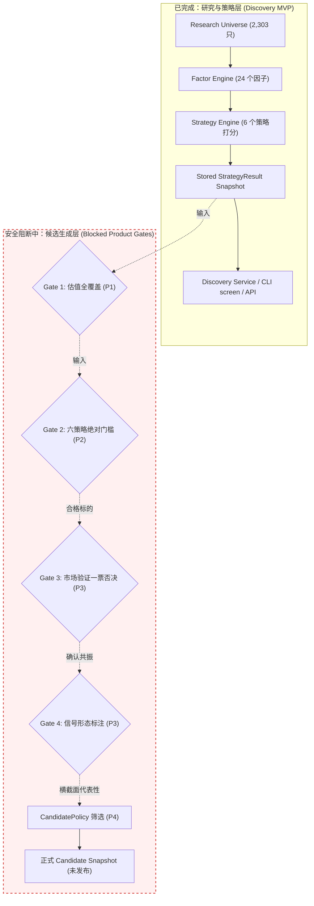

# 剩余产品阶段性阻塞项（Remaining Product Blockers）技术详解

**文档状态：** 核心架构技术说明  
**关联阶段：** P1–P5（紧接已交付的 Stock Discovery MVP）  
**权威依据：**
- [docs/superpowers/specs/2026-09-16-a-stock-lens-design.md](file:///Users/huangjinjin/Documents/ChatGPT/a-stock-lens/docs/superpowers/specs/2026-09-16-a-stock-lens-design.md)
- [docs/superpowers/specs/2026-09-17-candidate-qualification-design.md](file:///Users/huangjinjin/Documents/ChatGPT/a-stock-lens/docs/superpowers/specs/2026-09-17-candidate-qualification-design.md)
- [docs/PRODUCT.md](file:///Users/huangjinjin/Documents/ChatGPT/a-stock-lens/docs/PRODUCT.md)
- [docs/ROADMAP.md](file:///Users/huangjinjin/Documents/ChatGPT/a-stock-lens/docs/ROADMAP.md)

---

## 1. 架构总览：研究发现（Discovery）与正式候选（Candidate）的分水岭

在当前已交付的 **Stock Discovery MVP** 中，系统已经实现了对全量 **2,303** 只研究池股票的只读横截面打分与策略榜单查询（[`astock screen`](file:///Users/huangjinjin/Documents/ChatGPT/a-stock-lens/src/astock_lens/cli/app.py#L74) 与 `/strategies`、`/stocks/{symbol}` API）。

但必须确立的核心认知是：

$$\text{Strategy Result (策略评分/研究榜单)} \neq \text{Candidate (正式候选)} \neq \text{Investment Recommendation (买入推荐)}$$



目前日常管线中 `BUILD_CANDIDATES` 阶段被依法**强制安全阻断**（返回 `BLOCKED` / `not_published`）。阻断该阶段的 5 个关键技术卡点如下：

1. **Valuation Coverage（估值数据覆盖受限）**
2. **Six Absolute Qualification Rules（六策略绝对质量门槛生产配置未审定）**
3. **Market Regime（市场状态分类与切换引擎尚未实现）**
4. **Market Validation（市场阶段验证与一票否决引擎未建立）**
5. **Signal Engine（交易切入与跟踪形态信号未实现）**

下面逐项深入说明每个阻塞项的**代码现状、本质机理、为什么不能提前偷跑**以及**具体解除路径**。

---

## 2. 阻塞项 1：Valuation Coverage（估值数据全覆盖受限）

### 2.1 代码事实与现状
- **相关模块：** [`src/astock_lens/providers/`](file:///Users/huangjinjin/Documents/ChatGPT/a-stock-lens/src/astock_lens/providers/)、[`src/astock_lens/factors/`](file:///Users/huangjinjin/Documents/ChatGPT/a-stock-lens/src/astock_lens/factors/)、[`src/astock_lens/strategies/value.py`](file:///Users/huangjinjin/Documents/ChatGPT/a-stock-lens/src/astock_lens/strategies/value.py)、[`src/astock_lens/strategies/garp.py`](file:///Users/huangjinjin/Documents/ChatGPT/a-stock-lens/src/astock_lens/strategies/garp.py)。
- **实测数据：**
  在 2026-09-17 基线产物（`13,818` 条策略评估记录）中：
  - `Growth`：`2,302` 只可打分；
  - `Momentum`：`2,281` 只可打分；
  - `Quality`：`1,697` 只可打分（正常剔除非实体经营金融股）；
  - `Dividend`：`1,612` 只可打分；
  - **`Value`**：仅 **2** 只可打分；
  - **`GARP`**：仅 **1** 只可打分（单样本导致 `rank_percentile=None`）。

### 2.2 本质原因与阻断机理
- **数据源缺口：** Value 与 GARP 策略高度依赖估值因子（`pe_ttm`、`pb`、`peg`、`ps_ttm`）。当前本地离线原始数据中，neodata 估值数据源仅抓取了最初 5 只试点股票的估值数据，未在 2,303 只全研究池上批量运行全量抓取。
- **红线约束（禁止静默兜底）：** 项目底层规则明确禁止将缺失数据默认填充为 `0.0`。根据 [`DataStatus`](file:///Users/huangjinjin/Documents/ChatGPT/a-stock-lens/src/astock_lens/domain/enums.py) 规范，缺乏估值数据的因子必须记录为 `SOURCE_ERROR` 或 `NULL`。因此 Value/GARP 无法对缺少数据的 2,301 只股票进行伪造打分。

### 2.3 为什么不能提前“偷跑”？
若在估值数据仅覆盖 2 只股票时强行生成候选：
1. **样本严重偏倚：** 整个市场的 Value Top 1 实际只是“仅有的两只测试股票中估值较低的一只”，绝不是全市场深度价值股；
2. **GARP 分位数失真：** 单样本无法计算横截面分位数（Percentile 需要群体分布），导致下游门槛判定直接失效。

### 2.4 解除路径（P1）
1. 编写批量估值离线抓取脚本或扩展 Provider（如 AkShare / 专用接口），抓取全研究池 2,303 只标的的 PE/PB/PEG/股息率；
2. 运行标准化校验，确认估值因子在研究池覆盖率达到 90% 以上；
3. 重新生成正式因子与策略快照，使 Value 与 GARP 具备完整的全横截面排序能力。

---

## 3. 阻塞项 2：Six Absolute Qualification Rules（六策略绝对质量门槛）

### 3.1 代码事实与现状
- **相关模块：**
  - [`src/astock_lens/qualifications/contracts.py`](file:///Users/huangjinjin/Documents/ChatGPT/a-stock-lens/src/astock_lens/qualifications/contracts.py)
  - [`src/astock_lens/qualifications/registry.py`](file:///Users/huangjinjin/Documents/ChatGPT/a-stock-lens/src/astock_lens/qualifications/registry.py)
  - [`src/astock_lens/candidates/policy.py`](file:///Users/huangjinjin/Documents/ChatGPT/a-stock-lens/src/astock_lens/candidates/policy.py)
- **硬性断言阻断代码：**
  在 [`src/astock_lens/qualifications/registry.py#L51-L54`](file:///Users/huangjinjin/Documents/ChatGPT/a-stock-lens/src/astock_lens/qualifications/registry.py#L51-L54)：
  ```python
  rule = absolute_rules.get(strategy_id)
  if rule is None:
      raise QualificationRuleNotConfigured(
          f"Missing approved absolute qualification rule for strategy '{strategy_id}'"
      )
  ```
  在 [`src/astock_lens/candidates/policy.py#L18-L21`](file:///Users/huangjinjin/Documents/ChatGPT/a-stock-lens/src/astock_lens/candidates/policy.py#L18-L21)：
  ```python
  CANDIDATE_POLICY_DEFERRED = (
      "candidate qualification policy is Deferred: no approved rule exists, so no "
      "Candidate may be published (a measured score is not a qualification)"
  )
  ```

### 3.2 本质原因与阻断机理
- **双门槛模型（Dual Gate Architecture）：**
  系统设计明确规定，股票进入候选池必须**同时通过两道独立门槛**：
  1. **相对排名门槛**：`rank_percentile >= 0.90`（各策略前 10%）；
  2. **绝对质量门槛**：必须满足各策略独立的财务硬指标下限（例如 Growth 策略要求营收增速不得低于 15%，Quality 策略要求净资产收益率 ROE 不得低于 10% 等）。
- **当前现状：** 代码契约与加载器均已实现，但 `configs/qualifications/` 目录为空。所有生产环境的绝对门槛配置尚未由业务负责人（项目所有者）基于全市场真实统计分布进行审定。

### 3.3 为什么不能提前“偷跑”？
- **“高分不等于合格”**：在极端市场或弱势行业中，某些股票即使在单项策略中排名靠前（例如同板块最抗跌），但其实际财务状况可能仍在恶化。如果没有绝对质量门槛兜底，垃圾股也会因为“相对矮子里拔高个”被推送到候选池，引发致命误导。
- **AI 代理禁止自创业务规则**：根据 `AGENTS.md` 规则，未经业务所有者签字确认的阈值属于 `Deferred`，工程人员与 AI 严禁拍脑袋设定。

### 3.4 解除路径（P2）
1. 运行校准命令输出全池实测分位数分布报告：
   ```bash
   uv run astock calibrate candidates --as-of 2026-09-17 --output-dir var/calibration/
   ```
2. 项目所有者依据真实的分布表（P50、P75、P90），审定签发六个策略的生产配置文件：
   - `configs/qualifications/growth.yaml`
   - `configs/qualifications/momentum.yaml`
   - `configs/qualifications/quality.yaml`
   - `configs/qualifications/dividend.yaml`
   - `configs/qualifications/value.yaml`
   - `configs/qualifications/garp.yaml`
3. 将规则注入 [`build_qualifiers()`](file:///Users/huangjinjin/Documents/ChatGPT/a-stock-lens/src/astock_lens/qualifications/registry.py#L37)，解除 `QualificationRuleNotConfigured` 异常。

---

## 4. 阻塞项 3：Market Regime（市场研判与状态分类引擎）

### 4.1 代码事实与现状
- **相关模块：**
  - [`src/astock_lens/domain/enums.py`](file:///Users/huangjinjin/Documents/ChatGPT/a-stock-lens/src/astock_lens/domain/enums.py)（已定义 `MarketRegime` 五种枚举：`BULL`、`RANGE_UP`、`RANGE`、`RANGE_DOWN`、`BEAR`）；
  - `src/astock_lens/regime/` 尚未创建；
  - `configs/market_regime.yaml` 尚无判定阈值逻辑实现。

### 4.2 本质原因与阻断机理
- **系统职责定义：**
  Market Regime 负责从宏观与大盘维度对市场整体环境定性（结合上证指数、沪深300、全市场成交量、涨跌家数比、破净/新高比例）。
- **与策略路由的关系：**
  Market Regime **不修改单只股票的策略基础分**，但控制 `StrategyRouter`：
  - 在 `BEAR`（熊市）环境下，大幅下调动量与高成长策略展示权重，提升红利与高质量防御策略优先级；
  - 在 `BULL`（牛市）环境下，提升动量突破与成长扩张策略权重。
- 目前该模块的指标聚合算法、窗口期判定及状态转换平滑逻辑尚未实现。

### 4.3 为什么不能提前“偷跑”？
- 缺少 Market Regime 时，候选池无法感知市场处于流动性枯竭的阴跌期还是主升浪。在极端单边大跌行情中，依然盲目输出进攻型成长候选，会让系统丧失系统性风险防范能力。

### 4.4 解除路径（P3.1）
1. 在 `src/astock_lens/regime/` 下建立大盘指标提取与分类引擎；
2. 依据大盘日线（MA20/MA60、成交量量比、上涨家数均线）输出每日唯一的 `MarketRegimeResult`；
3. 接入管线阶段 `REGIME_STAGE`。

---

## 5. 阻塞项 4：Market Validation（市场阶段验证与一票否决）

### 5.1 代码事实与现状
- **相关模块：**
  - [`src/astock_lens/domain/enums.py`](file:///Users/huangjinjin/Documents/ChatGPT/a-stock-lens/src/astock_lens/domain/enums.py)（枚举包含 `CONFIRMED`、`NEUTRAL`、`CONTRADICTED`）；
  - [`src/astock_lens/candidates/policy.py#L28-L30`](file:///Users/huangjinjin/Documents/ChatGPT/a-stock-lens/src/astock_lens/candidates/policy.py#L28-L30)：
    ```python
    class CandidateEvidenceIncomplete(ValueError):
        """Raised when CandidateEvidence is missing upstream market validation or signal."""
    ```
  - [`src/astock_lens/candidates/policy.py#L98`](file:///Users/huangjinjin/Documents/ChatGPT/a-stock-lens/src/astock_lens/candidates/policy.py#L98)：排序与筛选显式要求 `market_validation`。

### 5.2 本质原因与阻断机理
- **核心职能：一票否决权（Veto Gate）**
  Market Validation 从五个技术与结构维度对策略候选标的进行多维度验证：
  1. **个股趋势（Stock Trend）**：是否站上关键均线系统；
  2. **行业趋势（Industry Trend）**：所属申万一级/二级行业是否处于强势区间；
  3. **相对强弱（Relative Strength）**：相对于基准指数（沪深300/中证500）是否具备超额收益动量；
  4. **量价行为（Price-Volume Action）**：放量滞涨还是缩量企稳；
  5. **流动性指标（Liquidity）**：日均成交额与换手率是否满足最低冲击成本。
- **一票否决规则：**
  若判定为 **`CONTRADICTED`**（例如基本面高成长但处于破位大跌、行业全面溃退、流动性枯竭状态），系统直接行使**一票否决**，剔除出候选池。
- **现状缺口：** 判定五项维度综合归纳为 `CONFIRMED / NEUTRAL / CONTRADICTED` 的量化规则未实现。

### 5.3 为什么不能提前“偷跑”？
- **严禁伪造 `NEUTRAL`**：如果因为没有算出来就静默将 `None` 改写为 `NEUTRAL`，等于变相放行了大量破位杀跌的“价值陷阱”股票，完全摧毁了候选池的风控屏障。

### 5.4 解除路径（P3.2）
1. 实现 `src/astock_lens/validation/` 验证模块，输入个股行情、行业行情与基准行情；
2. 明确量化打分判定表：确定哪些属于硬违背（`CONTRADICTED`），哪些属于共振确认（`CONFIRMED`）；
3. 单元测试覆盖一票否决、降权及中性情况，产出结构化的 `MarketValidationResult`。

---

## 6. 阻塞项 5：Signal Engine（形态与交易信号引擎）

### 6.1 代码事实与现状
- **相关模块：**
  - [`src/astock_lens/domain/enums.py`](file:///Users/huangjinjin/Documents/ChatGPT/a-stock-lens/src/astock_lens/domain/enums.py)（定义 `Signal` 七类状态：`BREAKOUT`、`PULLBACK`、`TREND_CONTINUE`、`TREND_WEAKEN`、`BREAKDOWN`、`NO_SIGNAL`、`WATCH`）；
  - `src/astock_lens/signals/` 模块尚未构建。

### 6.2 本质原因与阻断机理
- **形态切入定位：**
  - Signal 不负责基本面分析，也不发出任何 `BUY` 或 `SELL` 指令；
  - 它的职责是回答：**“基本面合格、市场已验证的标的，今天在技术图形上处于什么状态？”**
- **自选与跟踪跃迁（Watchlist Transition）：**
  下游自选列表状态机定义了从 `DISCOVERED` → `WATCH` → `TRACK_SIGNAL` 的演进。当且仅当出现明确的技术形态（如平台突破 `BREAKOUT` 或均线回调企稳 `PULLBACK`）时，系统才会推荐研究员将标的从观望（`WATCH`）转移到信号跟踪（`TRACK_SIGNAL`）。

### 6.3 为什么不能提前“偷跑”？
- 若缺少真实信号检测器，Candidate 就缺失了“触发进入视野的直接技术理由”；如果直接填入虚假的 `NO_SIGNAL`，下游 Watchlist 状态机将永远失去触发跃迁的能力。

### 6.4 解除路径（P3.3）
1. 实现价格形态识别器（基于 20/60 日均线拐点、支撑阻力位突破、量价背离等模式）；
2. 输出无投资建议色彩的纯客观状态标记 `SignalResult`；
3. 将其作为 `CandidateEvidence` 的第四大输入要素注入候选决策流程。

---

## 7. 终局集成：P4 正式候选发布（Candidate Publishing）

当上述五大阻塞项解除后，系统将正式打通 P4 候选发布链路：

```python
# 完整的 CandidateEvidence 组装链路（src/astock_lens/candidates/policy.py）
evidence = CandidateEvidence(
    symbol="600519.SH",
    strategy_results=(growth_result, quality_result),
    strategy_qualifications=(growth_qual, quality_qual),  # 必须通过双门槛
    market_validation=MarketValidation.CONFIRMED,         # 必须非空且未被否决
    signal=Signal.PULLBACK,                               # 客观形态状态
)
```

由 [`RepresentativeCandidatePolicy`](file:///Users/huangjinjin/Documents/ChatGPT/a-stock-lens/src/astock_lens/candidates/policy.py#L103) 执行跨策略代表性平衡：
- 每策略至少保留 3 只（软保底）；
- 全候选池不超过 50 只（硬上限）；
- 拒绝跨策略加权混合总分，基于字典序优先级（最佳策略百分位 → 合格策略数量 → 市场确认状态 → 股票代码）严格确定性排序；
- 产出正式的 `CANDIDATE` Snapshot。

---

## 8. 总结与执行路线指引

| 阶段 | 阻塞卡点 | 解决对象 | 核心产出物 | 负责主体 |
|---|---|---|---|---|
| **P1** | 估值覆盖率仅个位数 | 补充 2,303 全池估值数据 | PE/PB/PEG 全池覆盖与因子/策略重算 | 工程师（数据抓取与标准化） |
| **P2** | 六策略绝对质量门槛未定 | 审定真实校准证据 | 签发六份生产规则配置文件 `configs/qualifications/*.yaml` | 项目所有者（业务决策） |
| **P3** | 市场状态/验证/信号未实现 | 建立技术分析与风控网 | `regime/`、`validation/`、`signals/` 核心算法模块 | 架构师与工程师（算法落地） |
| **P4** | `BUILD_CANDIDATES` 阻断 | 打通候选端到端流水线 | 每日正式产出 `CANDIDATE` 快照 | 工程师（流水线组装） |
| **P5** | 候选上层交互未建 | 构建 Today 与 Web 交互 | CLI `astock today` 与六大前端视图面板 | 前端/全栈工程师 |

**当前行动准则：**  
在 P1–P3 未经正式批准与实现前，系统继续保持 **Stock Discovery MVP** 的只读研究状态，不提前跨入 Candidate 发布，不提供伪造的交易买卖建议。
