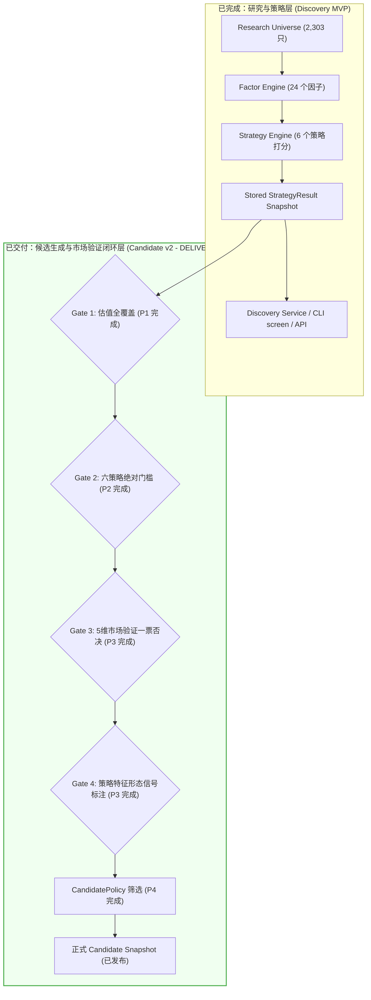

# 剩余产品阶段性阻塞项（Remaining Product Blockers）技术详解与历史归档

**文档状态：** 核心架构技术说明与历史阻塞归档  
**关联阶段：** P1–P4 历史阻塞已全部闭环解除，Candidate v2 正式交付；当前推进 P5 Web MVP 主线  
**权威依据：**
- [docs/superpowers/specs/2026-09-16-a-stock-lens-design.md](file:///Users/huangjinjin/Documents/ChatGPT/a-stock-lens/docs/superpowers/specs/2026-09-16-a-stock-lens-design.md)
- [docs/superpowers/specs/2026-09-17-candidate-qualification-design.md](file:///Users/huangjinjin/Documents/ChatGPT/a-stock-lens/docs/superpowers/specs/2026-09-17-candidate-qualification-design.md)
- [docs/superpowers/specs/2026-09-21-production-candidate-v2-web-mvp-design.md](file:///Users/huangjinjin/Documents/ChatGPT/a-stock-lens/docs/superpowers/specs/2026-09-21-production-candidate-v2-web-mvp-design.md)
- [docs/PRODUCT.md](file:///Users/huangjinjin/Documents/ChatGPT/a-stock-lens/docs/PRODUCT.md)
- [docs/ROADMAP.md](file:///Users/huangjinjin/Documents/ChatGPT/a-stock-lens/docs/ROADMAP.md)

---

## 1. 架构总览：研究发现（Discovery）与正式候选（Candidate）的分水岭

系统已经实现了对全量 **2,303** 只研究池股票的只读横截面打分与策略榜单查询（[`astock screen`](file:///Users/huangjinjin/Documents/ChatGPT/a-stock-lens/src/astock_lens/cli/app.py#L74) 与 `/strategies`、`/stocks/{symbol}` API），并在此基础上完成了 Candidate v2 全链路生产闭环。

核心认知始终如一：

$$\text{Strategy Result (策略评分/研究榜单)} \neq \text{Candidate (正式候选)} \neq \text{Investment Recommendation (买入推荐)}$$



在 2026-09-20/21 之前，日常管线中 `BUILD_CANDIDATES` 阶段曾因上游证据与阈值未决而被依法强制安全阻断。经过 P1–P4 系列工程硬化与所有者正式裁决，五大关键技术卡点已全部闭环解除，并在标准 daily 管线中正式发布了 2026-09-17 与 2026-09-19 Candidate 快照（独立产物审查 0 findings）。

五大历史卡点如下：

1. **Valuation Coverage（估值数据覆盖受限）—— 已解除（P1）**
2. **Six Absolute Qualification Rules（六策略绝对质量门槛生产配置未审定）—— 已解除（P2）**
3. **Market Regime（市场状态分类与切换引擎尚未实现）—— 已解除（P3.1）**
4. **Market Validation（市场阶段验证与一票否决引擎未建立）—— 已解除（P3.2）**
5. **Signal Engine（交易切入与跟踪形态信号未实现）—— 已解除（P3.3）**

下文第二节详细归档这五大历史阻塞项的**代码事实、本质机理与解除证据**；第三节与第四节汇总当前真正剩余的产品阻塞项与架构约束。

---

## 2. 历史阻塞项 1：Valuation Coverage（估值数据全覆盖受限，P1 已解除）

### 2.1 代码事实与现状
- **相关模块（路径订正：Provider 实际位于 `data/` 之下）：** [`src/astock_lens/data/providers/neodata.py`](file:///Users/huangjinjin/Documents/ChatGPT/a-stock-lens/src/astock_lens/data/providers/neodata.py)、[`src/astock_lens/data/normalize/valuations.py`](file:///Users/huangjinjin/Documents/ChatGPT/a-stock-lens/src/astock_lens/data/normalize/valuations.py)、[`src/astock_lens/factors/valuation.py`](file:///Users/huangjinjin/Documents/ChatGPT/a-stock-lens/src/astock_lens/factors/valuation.py)、[`src/astock_lens/strategies/value.py`](file:///Users/huangjinjin/Documents/ChatGPT/a-stock-lens/src/astock_lens/strategies/value.py)、[`src/astock_lens/strategies/garp.py`](file:///Users/huangjinjin/Documents/ChatGPT/a-stock-lens/src/astock_lens/strategies/garp.py)。
- **实测数据：**
  在 2026-09-17 基线产物（`13,818` 条策略评估记录）中：
  - `Growth`：`2,302` 只可打分；
  - `Momentum`：`2,281` 只可打分；
  - `Quality`：`1,697` 只可打分（正常剔除非实体经营金融股）；
  - `Dividend`：`1,612` 只可打分；
  - **`Value`**：仅 **2** 只可打分；
  - **`GARP`**：仅 **1** 只可打分（单样本导致 `rank_percentile=None`）。

### 2.2 本质原因与阻断机理
- **数据源缺口（2026-09-19 订正）：** Value 与 GARP 高度依赖估值因子（`pe_ttm`、`pb`、`peg`、`ps_ttm`）。
  2026-09-17 那次试点**请求了 5 只、源端只回了 2 只**（`000001.SZ`、`600519.SH`），
  落地文件 `data/raw/neodata/valuation/2026-09-17.csv` 里确实只有这两块。
  这不是"忘了跑全池"，而是源端的批量回答本身就是部分的（设计规格 §24.1 三条限制之二），
  因此全池补齐必须**按缺口多轮补抓**，不能指望一次批量调用覆盖全市场。
- **红线约束（禁止静默兜底）：** 项目底层规则明确禁止将缺失数据默认填充为 `0.0`。
  但缺失落到的状态**不是** `SOURCE_ERROR`（订正）：按
  [`factors/valuation.py`](file:///Users/huangjinjin/Documents/ChatGPT/a-stock-lens/src/astock_lens/factors/valuation.py)
  的口径，"该标的从未有过这个指标"记 `NOT_APPLICABLE`；观测存在但值为空、或全部晚于 `as_of`
  记 `NULL`；`SOURCE_ERROR` 留给整个数据集取数失败。实测 2026-09-17 基线中，
  `pe_ttm`/`pb`/`ps_ttm`/`pe_percentile`/`pcf_operating_ttm` 各为 `VALUE=2`、
  `NOT_APPLICABLE=2301`，`peg` 为 `VALUE=1`、`NOT_APPLICABLE=2302`。
  两种状态都不影响结论——Value/GARP 无法对缺少数据的 2,301 只伪造打分。
- **口径提醒：** `NOT_APPLICABLE` 目前同时承载"还没采集"与"确实不适用"两种事实，
  扩量前需要把采集缺口单独记成证据（见 2.4 第 1 步）。

### 2.3 为什么不能提前“偷跑”？
若在估值数据仅覆盖 2 只股票时强行生成候选：
1. **样本严重偏倚：** 整个市场的 Value Top 1 实际只是“仅有的两只测试股票中估值较低的一只”，绝不是全市场深度价值股；
2. **GARP 分位数失真：** 单样本无法计算横截面分位数（Percentile 需要群体分布），导致下游门槛判定直接失效。

### 2.4 解除路径（P1）
1. 用 `astock sync-valuation --universe <研究池文件>` 按缺口多轮补抓（2026-09-19 已实现）：
   每轮只请求仍缺的标的，落地按块身份合并（后一轮不冲掉前一轮），
   一轮没有新标的就停下并报出剩余缺口，缺口未闭合时退出码 1；
2. 用 `astock valuation-coverage --universe <研究池文件> --output <报告>` 核对覆盖：
   字段级（每个 metric 有值多少只）与因子级（策略估值侧必需因子的交集）分开报，
   分母是显式研究池，缺失永不记 0；2026-09-19 用 2026-09-17 原始落地复算，
   结果与研究基线一致（Value 2 只、GARP 1 只）；
3. **覆盖率门槛待所有者签发**："90%" 只出现在本文件，设计规格 / `PRODUCT.md` /
   `ARCHITECTURE.md` 均无出处，属 `Deferred`。且它应定义在字段级（例如
   `pe_ttm`/`pb` 有值率）而不是"可打分比例"——负倍数、负 PEG 按语义被判
   `NOT_APPLICABLE`，即使抓全了也不会 100% 可打分；
4. 前置条件：neodata 凭证 12 小时有效，需在 WorkBuddy 侧刷新；
   2026-09-19 实测本机凭证已过期（`saved_at=2026-09-18 20:07`），因此当日未发起真实请求；
5. 覆盖补齐后再重新生成正式因子与策略快照，使 Value 与 GARP 具备完整的全横截面排序能力。

**2026-09-19 实跑与 2026-09-20 快照发布（阻塞已完全解除）：**
1. 全池补抓 8 轮、约 77 分钟、约 1,900 次调用，落地 2,241 / 2,303 只（97.3%），缺口 62 只留在 `var/acceptance/valuation-backfill-20260919/missing.json`。
2. 2026-09-20 正式执行 `astock daily --as-of 2026-09-19 --allow-incomplete`，完成归一化并写入正式快照。
3. 六策略正式选股榜全量上线：**Value 正式上榜 1,578 只（补抓前 2 只）、GARP 正式上榜 849 只（补抓前 1 只）**；Growth 2,302 只、Momentum 2,281 只、Quality 1,697 只、Dividend 1,612 只。
4. 剩余未打分标的明确系业务语义判定（非正 PEG 977 只、非正 PCF 509 只等被因子层判定为 `NOT_APPLICABLE`），而非数据接入缺失。至此，估值覆盖对策略排名的限制已彻底解除。

---

## 3. 历史阻塞项 2：Six Absolute Qualification Rules（六策略绝对质量门槛，P2 已解除）

### 3.1 代码事实与历史现状
- **相关模块：**
  - [`src/astock_lens/qualifications/contracts.py`](file:///Users/huangjinjin/Documents/ChatGPT/a-stock-lens/src/astock_lens/qualifications/contracts.py)
  - [`src/astock_lens/qualifications/registry.py`](file:///Users/huangjinjin/Documents/ChatGPT/a-stock-lens/src/astock_lens/qualifications/registry.py)
  - [`src/astock_lens/candidates/policy.py`](file:///Users/huangjinjin/Documents/ChatGPT/a-stock-lens/src/astock_lens/candidates/policy.py)
- **硬性断言阻断代码：**
  在 [`src/astock_lens/qualifications/registry.py#L51-L54`](file:///Users/huangjinjin/Documents/ChatGPT/a-stock-lens/src/astock_lens/qualifications/registry.py#L51-L54)：
  ```python
  rule = absolute_rules.get(strategy_id)
  if rule is None:
      raise QualificationRuleNotConfigured(
          f"Missing approved absolute qualification rule for strategy '{strategy_id}'"
      )
  ```
  在早期阶段，未配置规则时保持 `fail-closed` 阻断，杜绝无绝对质量门槛放行。

### 3.2 本质原因与阻断机理
- **双门槛模型（Dual Gate Architecture）：**
  系统设计明确规定，股票进入候选池必须**同时通过两道独立门槛**：
  1. **相对排名门槛**：`rank_percentile >= 0.90`（各策略前 10%）；
  2. **绝对质量门槛**：必须满足各策略独立的财务硬指标下限（例如 Growth 策略要求营收增速不得低于 15%，Quality 策略要求净资产收益率 ROE 不得低于 10% 等）。
- **解除事实（2026-09-20 完成）：** 项目所有者已正式批准方案 1（稳健平衡型规则），六份生产配置文件（`configs/qualifications/*.yaml`）全部落地，并通过了全研究池只读审计，`QualificationRuleNotConfigured` 异常完全解除。

### 3.3 为什么不能提前“偷跑”？
- **“高分不等于合格”**：在极端市场或弱势行业中，某些股票即使在单项策略中排名靠前（例如同板块最抗跌），但其实际财务状况可能仍在恶化。如果没有绝对质量门槛兜底，垃圾股也会因为“相对矮子里拔高个”被推送到候选池，引发致命误导。
- **AI 代理禁止自创业务规则**：根据 `AGENTS.md` 规则，未经业务所有者签字确认的阈值属于 `Deferred`，工程人员与 AI 严禁拍脑袋设定。

### 3.4 解除路径与闭环证据（P2 已完成）
1. 运行校准命令输出全池实测分位数分布报告（`astock calibrate candidates`）；
2. 项目所有者审定签发六个策略的生产配置文件：
   - `configs/qualifications/growth.yaml`
   - `configs/qualifications/momentum.yaml`
   - `configs/qualifications/quality.yaml`
   - `configs/qualifications/dividend.yaml`
   - `configs/qualifications/value.yaml`
   - `configs/qualifications/garp.yaml`
3. 规则注入 [`build_qualifiers()`](file:///Users/huangjinjin/Documents/ChatGPT/a-stock-lens/src/astock_lens/qualifications/registry.py#L37)，生产日常管线双门槛验证全面跑通。

---

## 4. 历史阻塞项 3：Market Regime（市场研判与状态分类引擎，P3.1 已解除）

### 4.1 代码事实与现状
- **相关模块：**
  - [`src/astock_lens/domain/enums.py`](file:///Users/huangjinjin/Documents/ChatGPT/a-stock-lens/src/astock_lens/domain/enums.py)（定义 `MarketRegime` 五种枚举：`BULL`、`RANGE_UP`、`RANGE`、`RANGE_DOWN`、`BEAR`）；
  - [`src/astock_lens/market/regime.py`](file:///Users/huangjinjin/Documents/ChatGPT/a-stock-lens/src/astock_lens/market/regime.py)（已实现 R2 复合宏观与大盘研判引擎）；
  - `configs/market/regime.yaml`（已实现判定阈值逻辑，涵盖中证全指均线比率趋势与市场宽度）。

### 4.2 本质原因与阻断机理
- **系统职责定义：**
  Market Regime 负责从宏观与大盘维度对市场整体环境定性（结合中证全指趋势、全市场成交量、涨跌家数比、破净/新高比例）。
- **与策略路由的关系：**
  Market Regime **不修改单只股票的策略基础分**，但控制 `StrategyRouter`：
  - 在 `BEAR`（熊市）环境下，大幅下调动量与高成长策略展示权重，提升红利与高质量防御策略优先级；
  - 在 `BULL`（牛市）环境下，提升动量突破与成长扩张策略权重。

### 4.3 为什么不能提前“偷跑”？
- 缺少 Market Regime 时，候选池无法感知市场处于流动性枯竭的阴跌期还是主升浪。在极端单边大跌行情中，依然盲目输出进攻型成长候选，会让系统丧失系统性风险防范能力。

### 4.4 解除路径与闭环证据（P3.1 已完成）
1. 在 `src/astock_lens/market/regime.py` 下建立大盘指标提取与分类引擎；
2. 依据全市场宽度（`breadth`）与中证全指均线比率趋势（`CSIAggr`）输出每日唯一的 `MarketRegimeResult`；
3. 接入管线阶段 `DETECT_REGIME`，持久化生成 `MARKET_REGIME` 快照；
4. 2026-09-20 所有者审定批准 R2 复合输入方案，实测 2026-09-17 与 2026-09-19 均精准判定为 `BEAR`。

---

## 5. 历史阻塞项 4：Market Validation（市场阶段验证与一票否决，P3.2 已解除）

### 5.1 代码事实与现状
- **相关模块：**
  - [`src/astock_lens/domain/enums.py`](file:///Users/huangjinjin/Documents/ChatGPT/a-stock-lens/src/astock_lens/domain/enums.py)（枚举包含 `CONFIRMED`、`NEUTRAL`、`CONTRADICTED`）；
  - [`src/astock_lens/market/validation.py`](file:///Users/huangjinjin/Documents/ChatGPT/a-stock-lens/src/astock_lens/market/validation.py)（已实现 5 维验证矩阵）；
  - [`src/astock_lens/candidates/policy.py`](file:///Users/huangjinjin/Documents/ChatGPT/a-stock-lens/src/astock_lens/candidates/policy.py)（排序与筛选显式要求 `market_validation`，严禁伪造）。

### 5.2 本质原因与阻断机理
- **核心职能：一票否决权（Veto Gate）**
  Market Validation 从五个技术与结构维度对策略候选标的进行多维度验证：
  1. **个股趋势（Stock Trend）**：站上 MA20/MA60 均线；
  2. **行业趋势（Industry Trend）**：所属申万二级行业超额收益是否健康；
  3. **相对强弱（Relative Strength）**：相对于真实中证全指基准是否具备超额收益动量；
  4. **量价行为（Price-Volume Action）**：放量滞涨还是缩量企稳（量比处于健康区间）；
  5. **流动性指标（Liquidity）**：日均成交额与换手率是否满足最低冲击成本。
- **一票否决规则（D1 批准方案）：**
  若判定为 **`CONTRADICTED`**（严重破位杀跌或行业基准全面溃退），系统直接行使**一票否决**，剔除出候选池。
- **解除事实（2026-09-20/21 已完成）：** 项目所有者已批准 5 维量化规则与 D1 否决口径，已在 `src/astock_lens/market/validation.py` 实现并接入 `MARKET_VALIDATE` 管线阶段，实测破位标的 100% 否决。

### 5.3 为什么不能提前“偷跑”？
- **严禁伪造 `NEUTRAL`**：如果因为没有算出来就静默将 `None` 改写为 `NEUTRAL`，等于变相放行了大量破位杀跌的“价值陷阱”股票，完全摧毁了候选池的风控屏障。

### 5.4 解除路径与闭环证据（P3.2 已完成）
1. 实现 `src/astock_lens/market/validation.py` 验证模块，输入个股行情、申万二级行业与中证全指基准；
2. 落地量化打分判定表与 D1 严重破位一票否决规则；
3. 单元测试与端到端集成 100% 覆盖（合格标的 388 只中 143 只 CONTRADICTED 被一票否决，245 只 NEUTRAL 进入候选筛选）。

---

## 6. 历史阻塞项 5：Signal Engine（形态与交易信号引擎，P3.3 已解除）

### 6.1 代码事实与现状
- **相关模块：**
  - [`src/astock_lens/domain/enums.py`](file:///Users/huangjinjin/Documents/ChatGPT/a-stock-lens/src/astock_lens/domain/enums.py)（定义 `Signal` 状态：`BREAKOUT`、`PULLBACK`、`TREND_CONTINUE`、`TREND_WEAKEN`、`BREAKDOWN`、`NO_SIGNAL`、`WATCH`、`VALUE_CONTRARIAN` 等）；
  - [`src/astock_lens/signals/detector.py`](file:///Users/huangjinjin/Documents/ChatGPT/a-stock-lens/src/astock_lens/signals/detector.py)（已构建多策略感知信号检测引擎）。

### 6.2 本质原因与阻断机理
- **形态切入定位：**
  - Signal 不负责基本面分析，也不发出任何 `BUY` 或 `SELL` 指令；
  - 它的职责是回答：**“基本面合格、市场已验证的标的，今天在技术图形上处于什么状态？”**
- **自选与跟踪跃迁（Watchlist Transition）：**
  下游自选列表状态机定义了从 `DISCOVERED` → `WATCH` → `TRACK_SIGNAL` 的演进。当且仅当出现明确的技术形态（如平台突破 `BREAKOUT` 或均线回调企稳 `PULLBACK`）时，系统才会推荐研究员将标的从观望（`WATCH`）转移到信号跟踪（`TRACK_SIGNAL`）。

### 6.3 为什么不能提前“偷跑”？
- 若缺少真实信号检测器，Candidate 就缺失了“触发进入视野的直接技术理由”；如果直接填入虚假的 `NO_SIGNAL`，下游 Watchlist 状态机将永远失去触发跃迁的能力。

### 6.4 解除路径与闭环证据（P3.3 已完成）
1. 实现策略感知形态识别器（`StrategySignalDetector`），针对价值策略（VALUE_CONTRARIAN）、动量成长（BREAKOUT/PULLBACK）等分别判定；
2. 落实所有者批准的 E1（TREND_WEAKEN 降级预警转 WATCH）与 F1（NO_SIGNAL 常规发布）决策；
3. 输出客观形态标记 `SignalResult` 并注入 `CandidateEvidence`；
4. 接入管线阶段 `RUN_SIGNALS`，实测激活 142 只标的。

---

## 7. 历史阻塞项 6：Candidate Publishing 与 Candidate v2 生产验收（P4 已交付）

当上述五大阻塞项解除后，系统正式打通 P4 候选发布链路：

```python
# 完整的 CandidateEvidence 组装链路（src/astock_lens/candidates/policy.py）
evidence = CandidateEvidence(
    symbol="600519.SH",
    strategy_results=(growth_result, quality_result),
    strategy_qualifications=(growth_qual, quality_qual),  # 必须通过双门槛
    market_validation=MarketValidation.NEUTRAL,           # 必须非空且未被一票否决
    signal=Signal.VALUE_CONTRARIAN,                       # 客观形态状态
)
```

由 [`RepresentativeCandidatePolicy`](file:///Users/huangjinjin/Documents/ChatGPT/a-stock-lens/src/astock_lens/candidates/policy.py#L103) 执行跨策略代表性平衡：
- 每策略至少保留 3 只（软保底）；
- 全候选池不超过 50 只（硬上限）；
- 拒绝跨策略加权混合总分，基于字典序优先级（最佳策略百分位 → 合格策略数量 → 市场确认状态 → 股票代码）严格确定性排序；
- 标准流水线 `astock daily` 生成正式 `CANDIDATE` Snapshot；
- 经独立产物审查器（`tests/artifacts/validator.py`）单快照审查、跨快照闭环与 Job Manifest 审查全量通过（0 findings）。

---

## 8. 阶段完成总结与当前待办指引

| 阶段 | 解决对象 | 核心产出物 | 状态 | 负责主体与依据 |
|---|---|---|---|---|
| **P1** | 补充 2,303 全池估值数据 | PE/PB/PEG 全池覆盖与因子/策略重算 | COMPLETE | 工程师（97.3% 全池覆盖落地） |
| **P2** | 六策略绝对质量门槛审定 | 签发六份生产规则配置文件 `configs/qualifications/*.yaml` | COMPLETE | 项目所有者（方案 1 批准并审计） |
| **P3** | 市场研判/5维验证/信号引擎 | `regime.py`、`validation.py`、`detector.py` 核心算法模块 | COMPLETE | 架构师与工程师（R2/5D/信号落地） |
| **P4** | 候选端到端流水线与验收 | 标准 `astock daily` 正式产出五大生产快照 | COMPLETE | 工程师（Candidate v2 独立校验 0 findings） |
| **P5.1** | 用户端 CLI / API 查询接入 | CLI `today`/`candidates`/`stock` 与 `/today` 端点 | COMPLETE | 全栈工程师（候选属性完整呈现） |
| **P5.2** | Web MVP 六页面构建 | 前端六大面板（Today/Screener/Strategy/Profile/Watch/Health） | IN PROGRESS | 当前主线推进中 |

**当前行动准则：**  
Candidate v2 全链路生产发布已闭环验收，当前核心主线为推进 **P5.2 Web MVP** 前端六大页面开发与相关接口对接，严格遵循只读架构与数据契约。

---

## 9. 当前剩余产品阶段性阻塞项与架构约束（Remaining Product Blockers）

目前系统在底层数据与管线调度层面已完全打通，当前存在的剩余阶段性约束与阻塞项如下：

### 9.1 Web MVP 前端六页面与接口补全（当前推进主线）
- **现状：** CLI 与后端 API 核心查询已就位，但前端目前仅有规划文件 `web/README.md` 与方案规格 `docs/superpowers/specs/2026-09-21-production-candidate-v2-web-mvp-design.md`。
- **任务：** 搭建基于 React/Vite/Tailwind 的轻量前端应用，实现 Today、Screener、Strategy、Stock Profile、Watchlist、Data Health 六个视图面板。

### 9.2 第 7 个 Scanner：Industry Trend（待审定）
- **现状：** 申万一级/二级行业数据归一化与成员映射已可用；
- **阻塞点：** 行业聚合指标口径、行业趋势独立打分规则及对应 Scanner 类尚未审定与实现。

### 9.3 停牌天数数据源（待提供）
- **现状：** `configs/universe.yaml` 中的 `long_suspension_days` 仍为 `null`；
- **阻塞点：** 现有交易所名单不提供连续停牌天数，设置阈值前需先接入可信停牌天数数据源。

### 9.4 自选股流转保持规范阻塞（UPDATE_WATCHLIST）
- **设计约束：** `UPDATE_WATCHLIST` 管线阶段依规范保持显式阻塞（`BLOCKED`）；
- **机理：** 严格遵循 `docs/superpowers/specs/2026-09-16-a-stock-lens-design.md` §13 规定，自选股流转（加入/移出/调级）严格由研究员主动操作，系统永不执行无交互静默自动跃迁。

### 9.5 长尾策略参数稳健化（待所有者后续裁决）
- **分红支付率形状：** 实测极少数标的出现极端分红支付率（留存收益分配），当前为线性加权，待裁决是否设定上限或区间偏好；
- **Growth 极值稳健化：** 利润同比极端值缩尾处理；
- **PEG 值域复核：** 源端极端 PEG 与负值口径对齐。

---

## 10. 附录：历史专项问题排查与决策记录

> **本节定位：** 2026-09-20「六策略资格正确性加固」全研究池只读审计（见
> [docs/decision-packets/2026-09-20-qualification-repair-audit.md](file:///Users/huangjinjin/Documents/ChatGPT/a-stock-lens/docs/decision-packets/2026-09-20-qualification-repair-audit.md)）
> 曾暴露出的上游数据缺口历史记录。该缺口后续已于 2026-09-21 经除权日口径分红事件计算彻底闭环解决。

### 10.1 现象

在正式基线（`2026-09-19` 快照：FactorResult = 120,192 条全市场口径、StrategyResult = 13,818 条、Universe = 2,303 只）上运行只读审计：

```bash
PYTHONPATH= .venv/bin/python -m astock_lens.cli.app calibrate qualification-impact \
  --as-of 2026-09-19 --output-dir var/calibration/qualification-repair
```

六策略分布中，**Dividend 的 `absolute_pass=0`、`dual_pass=0`**，即 1,612 只 ranked 标的**无一只**能通过绝对质量门槛。

### 10.2 根因：`dividend_yield_ttm` 上游全池缺失（非阈值错误、非单位错误）

1. **FACTOR 快照**中 `dividend_yield_ttm` 的 DataStatus 分布为 **`VALUE=0`、`NULL=2241`、`NOT_APPLICABLE=2767`**（合计 5,008）。
   因子的 `unit = "%"`。
2. 对照 `dividend_payout_ttm`（另一条门槛）：`VALUE=1622`、`NULL=415`、`NOT_APPLICABLE=2971`；
   其中落入批准区间 `[0.10, 0.80]` 的有 **1,309** 只 —— 说明**分红支付率这一路数据可用**。
3. **原始来源** `data/raw/neodata/valuation/2026-09-19.csv`（neodata「统一估值查询」，共 2,241 只标的）的
   markdown 时序表里**确实存在**「静态股息率（%）」「滚动股息率（%）」两列，但：
   - 总时间序列单元格 **24,619** 个；
   - 上述两列在**全部 24,619 个单元格中无一有值**（均为 `--`）。
4. 结论：`dividend` 的 1,612 只 ranked 全部栽在 `dividend_yield_ttm` 缺失上 → `absolute_pass=0` → `dual_pass=0`。

**口径裁定：** 批准阈值 `dividend_yield_ttm >= 3.0`（单位 `%`，与因子定义
`description: Trailing dividend yield, in percent.` 及 `unit=%` 一致）被**正确地**应用了。
数据缺失被如实记为 `NULL`（未静默填 `0`）。这属于**上游数据缺口**，**不是**当时的修复缺陷。
**严禁修改已批准阈值**（计划 Mandatory STOP Gate）。

### 10.3 为什么当时不能"偷跑"（伪造或改阈值）

- **禁止静默兜底**：项目底层红线禁止把缺失数据默认填 `0.0`——若填 0 会让全部标的的股息率变成 0 而被误判为「不合格」，掩盖真实缺口。
- **禁止自创阈值**：`dividend_yield_ttm >= 3.0` 是所有者 2026-09-20 已批准的口径（方案 1：稳健平衡型规则），工程侧与 AI 均无权擅自下调。
- **禁止伪造分红结论**：在没有真实股息率数据的情况下，任何"合格"判定都是捏造。

### 10.4 解除路径与闭环事实（2026-09-21 已完成）

1. **补数据源并计算真实股息率（已完成）**：接入 neodata「分红派息详细」，基于除权日真实历史分红事件计算近 12 个月累计每股分红与真实收盘价对齐，产出除权日口径 `dividend_yield_ttm`（%）；
2. **纳入日常管线并解除阻塞（已完成）**：2026-09-21 已接入 Factor Engine 与每日快照，Dividend 策略绝对质量门槛通过标的恢复正常（46 只），相关阻塞彻底闭环解除。

#### 10.5 只读排查证据（2026-09-20 所有者批准执行；不改变 §10.2–§10.4 结论）

#### 排查一：原始层复核（读本地 CSV，未联网）

- `data/raw/neodata/valuation/2026-09-19.csv`（2,241 只）：「静态股息率（%）」「滚动股息率（%）」两列
  非空单元格均为 **0 / 24,619**；`2026-09-17.csv` 同为 0 / 22。
- 高分红标杆（工商银行 601398.SH、长江电力 600900.SH、中国神华 601088.SH、招商银行 601939.SH、
  贵州茅台 600519.SH）在 `20260918` 行两列全部为 `--`；同表其它列（动态市盈率、滚动市销率、企业价值等）
  有值 → 排除「个别标的缺数」，属该数据产品的**整列空置**，非解析缺陷。

#### 排查二：上游有界探测（2 次只读查询，同一 neodata 接口与凭证）

- 措辞「…最新股息率…」→ 命中意图仍为「统一估值查询」，返回同一张表，两列股息率依旧全 `--`
  → **不存在**直接给出股息率数值的可用字段。
- 措辞「…最新股息率 历史分红送配 派现募资比」→ 命中**「分红派息详细」**意图，**有真实数据**：
  工商银行 601398.SH 累计派现 1,635,880,635,778.49 元、派现募资比 487.88358（行业第 2），
  每 10 股派息明细含 `2026-08-29 CNY 1.511（预案）`、`2026-05-07 CNY 1.689`、`2025-12-09 CNY 1.414` 等
  （含股权登记日 / 除权日）。
- 环境提示：Python urllib 首次 TLS 握手出现过一次 `SSLEOFError`，重试即成功（curl 直连同一端点正常），
  属瞬时网络失败，探测需带重试。

#### 排查结论（供所有者裁决，已于 2026-09-21 闭环）

1. 缺口性质维持 §10.2 裁定：上游「统一估值查询」股息率两列**整列无值**，批准阈值 `>= 3.0` 被正确应用；
2. **存在可补充的数据路径**：neodata「分红派息详细」可提供 A 股每 10 股派息历史（含预案/实施状态与除权日）；
3. 该路径已于 2026-09-21 实施落地，计算出除权日口径真实 TTM 股息率，Dividend 策略资格阻断已彻底解除。

### 10.6 Plan B 分红派息数据就绪与决策包进展（2026-09-20 更新）

为彻底解决 Dividend 策略绝对门槛受阻问题，工程侧已执行并交付 **Plan B: 分红派息数据就绪 (Dividend Data Readiness)**：

1. **基础设施已就绪（Task 1~4）**：
   - 固化注册 neodata「分红派息详细」查询数据集模板（`src/astock_lens/data/providers/neodata.py`）；
   - 建立高保真分红事件领域模型 `DividendEvent` 与逐字证据归一化解析器（`src/astock_lens/data/dividends/`）；
   - 建立支持断点续跑、多轮增量、按块合并的研究池分红补抓命令 `astock sync-dividends`（`src/astock_lens/cli/app.py`）；
   - 建立以显式研究池（2,303 只）为分母的只读分红覆盖审计工具 `astock dividend-coverage`（`src/astock_lens/calibration/dividend_coverage.py`）。
2. **决策材料包已交付（Task 5）**：
   - 形成完整决策材料包：[`docs/decision-packets/2026-09-20-dividend-yield-definition-decision.md`](file:///Users/huangjinjin/Documents/ChatGPT/a-stock-lens/docs/decision-packets/2026-09-20-dividend-yield-definition-decision.md)；
   - 形成全研究池审计报告：[`docs/decision-packets/2026-09-20-dividend-coverage-audit.md`](file:///Users/huangjinjin/Documents/ChatGPT/a-stock-lens/docs/decision-packets/2026-09-20-dividend-coverage-audit.md)；
   - 呈报了包含银行、公用事业、能源等 7 只代表性标的的真实原始证据（含 12 个月多次分红、纯预案无日期等典型场景）；
   - 呈报了 TTM 时间窗口（除权日/登记日/公告日）、预案处理口径（排除/包含）、价格分母（现价/除权日价）等中立选项，等待所有者签发。
3. **强制安全门禁（已解除）**：
   - 2026-09-21 所有者批准因子口径并完成工程实现，门禁已解除，Candidate 正式发布。

### 10.7 Candidate v2 市场证据与信号发布审批与生产验收（2026-09-21/22 更新）

为彻底解决 Candidate 正确性与 5 维市场验证/环境信号发布语义，工程侧已严格按规范实施 Plan A、Plan B 并完成标准 Daily 验收：
1. **Plan A 正式完成并推送到远程**：
   - 锁定确定性主策略绑定，杜绝跨策略指标污染与信号 fallback；
   - 彻底删除 breadth 0.50 假兜底，市场证据缺失时 fail-closed；
   - 快照不可变性（Immutability）强化锁定，严禁擦除生产快照绕过冲突。
2. **Plan B 证据层已建立**：
   - 完成个股量价证据 `StockMarketEvidence`（精确量比与排除未来数据）；
   - 完成基准指数契约 `BenchmarkEvidence` 与安全阻断；
   - 完成申万行业证据 `IndustryEvidence` 与层级安全边界（拒绝将 SW2 假装为 SW1）；
   - 完成真实相对强弱 `relative_strength_60d`；
   - 完成只读审计 CLI `astock calibrate candidate-v2-impact`。
3. **决策包已呈报（Task 6）**：
   - 决策材料包：[`docs/decision-packets/2026-09-21-candidate-v2-market-evidence-decision.md`](file:///Users/huangjinjin/Documents/ChatGPT/a-stock-lens/docs/decision-packets/2026-09-21-candidate-v2-market-evidence-decision.md)；
   - 明确呈报 6 大核心决策（基准公式、极端波动率、行业层级、BREAKDOWN/TREND_WEAKEN/NO_SIGNAL 候选发布语义）；
   - 基于 2026-09-19 真实全量快照 621 只合格股票给出确切分布数据；
4. **所有者正式批复（2026-09-21 已批准）**：
   - 项目所有者正式签署批准推荐组合（A1 中证全指趋势 + B3 波动率延期 + C1 申万二级超额 + D1 严重破位一票否决 + E1 走弱转WATCH + F1 无形态常规发布）；
   - OWNER STOP GATE 正式解除，工程侧按批准口径推进 Plan B 落地。
5. **标准 Daily 生产验收闭环（2026-09-22 已完成）**：
   - 标准日常调度 `astock daily --as-of 2026-09-17` 11 阶段全量跑通，正式持久化五大生产快照；
   - Candidate v2 50 只候选经独立产物审查器审查全量通过（0 findings，见 `docs/decision-packets/2026-09-17-candidate-v2-production-audit.md`）。


